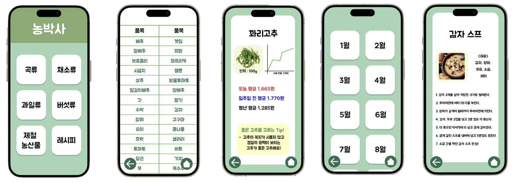

# 농박사 (Farm Doctor)
**농산물 시세 및 제철 농산물, 레시피 안내 플랫폼**

<div align="center">
  
  <br><br>
  
</div>

> ⚠️ **안내**: 원래 웹(`FarmDoctor_WEB`)과 앱(`Farm_doctor`) 레포지토리가 분리되어 있었으나, 포트폴리오 정리를 위해 하나의 레포지토리로 통합하였습니다. 
> - 웹 원본: [na0young/Farmer_WEB](https://github.com/na0young/Farmer_WEB.git)
> - 앱 원본: [yeonnnnni/Farm_doctor](https://github.com/yeonnnnni/Farm_doctor.git)

---

## 🏆 수상

**KAMIS 활용사례 공모전 우수상** (2023.12)

---

## 프로젝트 배경 및 목적

농산물은 우리 생활의 중요한 부분이며, 가격 변동 및 계절에 따른 변화가 빈번합니다. 농산물 시세 정보에 대한 쉬운 접근과 농산물 구매 및 요리 결정을 돕기 위해 이 프로젝트를 시작하였습니다.

- **소비자 편의성**: 일상적인 농산물 구매 결정을 내리는 데 도움
- **식품 안전성**: 신선한 제철 농산물 구매 유도
- **식습관 개선**: 레시피 아이디어 제공으로 다양한 요리 가능

---

## 팀 구성 및 담당 역할

**개발 기간**: 2023.09 ~ 2023.12 (4개월) | **팀원**: 4명

| GitHub | 역할 |
|--------|------|
| jga-eun (본인) | 기획, 디자인, 백엔드, 프론트엔드 |
| [@na0young](https://github.com/na0young) | 기획, 백엔드, 프론트엔드 |
| [@yeonnnnni](https://github.com/yeonnnnni) | 기획, 백엔드, 프론트엔드 |
| [@LeeDayoung1](https://github.com/LeeDayoung1) | 기획, 백엔드, 프론트엔드 |

### 제가 담당한 주요 작업은 다음과 같습니다

| 구분 | 내용 |
|------|------|
| **PM** | 프로젝트 전체 일정 관리 및 기획 |
| **Design** | Figma, Procreate를 활용한 UI/UX 디자인 |
| **DB 설계** | MySQL 스키마 설계 및 구축 (foodCrop, vegetable, specialCrop, fruit, recipe, tip 등) |
| **Web 개발** | 프론트엔드 및 백엔드 전체 구현 (HTML/CSS/JS + XAMPP/PHP) |
| **App 기여** | MySQL DB 설계 및 구축 기여 |

---

## 주요 기능

앱과 웹 모두 동일한 기능을 제공합니다.

- 농산물 부류(식량작물, 채소, 특용작물, 과일) 선택 및 품목별 시세 조회
- 작일, 7일 전, 평년 시세 비교 제공
- 월별 제철 농산물 안내
- 선택 농산물 관련 레시피 정보 제공
- 농산물 구매 가이드 제공

| 플랫폼 | 구현 방식 |
|--------|-----------|
| **앱** | Java (Android), JDBC → MySQL 연동 |
| **웹** | HTML/CSS/JS + PHP (XAMPP), fetch → MySQL 연동 |

---

## 기술 스택


| 구분 | 사용 기술 |
|------|-----------|
| 앱 개발 | Java (Android Studio) |
| 웹 개발 | HTML, CSS, JavaScript, PHP |
| 데이터베이스 | MySQL (XAMPP, mysql-connector-java-5.1.4) |
| API | KAMIS 농산물 유통정보 Open API |
| 데이터 처리 | Python (KAMIS API 데이터 선별 및 자동 삽입) |
| 디자인 | Figma, Procreate |

---

## 프로젝트 구조

```
FarmDoctor_Public/
├── web/
│   ├── main.html                  # 메인 페이지
│   ├── foodCrop.html              # 식량작물 시세
│   ├── vegetable.html             # 채소 시세
│   ├── specialCrop.html           # 특용작물 시세
│   ├── fruit.html                 # 과일 시세
│   ├── foodCropData.html          # 식량작물 상세 시세
│   ├── vegetableData.html         # 채소 상세 시세
│   ├── specialCropData.html       # 특용작물 상세 시세
│   ├── fruitData.html             # 과일 상세 시세
│   ├── seasonalProduce.html       # 제철 농산물 (월별)
│   ├── Jan.html ~ Dec.html        # 월별 제철 농산물 페이지
│   ├── recipePage.html            # 레시피 메인
│   ├── foodCropRecipe.html        # 식량작물 레시피
│   ├── vegetableRecipe.html       # 채소 레시피
│   ├── specialCropRecipe.html     # 특용작물 레시피
│   ├── fruitRecipe.html           # 과일 레시피
│   └── img/                       # 이미지 파일
└── app/                           # 안드로이드 앱 (Java)
```

---

## 데이터베이스 구조

KAMIS API로부터 수집한 데이터를 Python으로 선별 후 MySQL에 저장하여 앱과 웹에서 활용합니다.

```
Farmer DB
├── foodCrop      # 식량작물 시세
├── vegetable     # 채소 시세
├── specialCrop   # 특용작물 시세
├── fruit         # 과일 시세
├── recipe        # 레시피 URL
└── tip           # 농산물 구매 가이드
```
